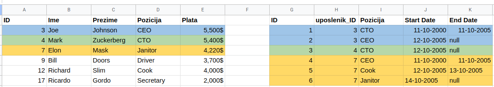

# Data journalism radionica

## Šta je data journalism

Novinarstvo sa fokusom na prikupljanje, obradu, vizualizaciju i komunikaciju podataka.

## Šta je podatak
Niz posmatranja koji imaju zajedničke atribute

Primjer: Uposlenici u nekoj kompaniji

Kompanija X, uposlenici

| ID | Ime | Prezime |  Pozicija |  Plata | 
| ----------- | ----------- |----------- |-----------|-----------|
| 3 | Joe     | Johnson | CEO| 5500$
| 4 | Mark | Zuckerberg | CTO| 5400$
| 7 | Elon | Mask       | Janitor| 4220$
| 9 | Bill | Doors      | Driver| 3700$
| 12| Richard | Slim    | Cook| 4000$
| 17| Ricardo | Gordo | Secretary | 2000$

### CSV
```

ID,Ime,Prezime,Pozicija,Plata
3,Joe,Johnson,CEO,5500$
4,Mark,Zuckerberg,CTO,5400$
7,Elon,Mask,Janitor,4220$
9,Bill,Doors,Driver,3700$
12,Richard,Slim,Cook,4000$
17,Ricardo,Gordo,Secretary,2000$
```

### XML
```
<?xml version="1.0" encoding="UTF-8"?>
<root>
  <row>
    <ID>3</ID>
    <Ime>Joe</Ime>
    <Prezime>Johnson</Prezime>
    <Pozicija>CEO</Pozicija>
    <Plata>5500$</Plata>
  </row>
  <row>
    <ID>4</ID>
    <Ime>Mark</Ime>
    <Prezime>Zuckerberg</Prezime>
    <Pozicija>CTO</Pozicija>
    <Plata>5400$</Plata>
  </row>
  <row>
    <ID>7</ID>
    <Ime>Elon</Ime>
    <Prezime>Mask</Prezime>
    <Pozicija>Janitor</Pozicija>
    <Plata>4220$</Plata>
  </row>
  <row>
    <ID>9</ID>
    <Ime>Bill</Ime>
    <Prezime>Doors</Prezime>
    <Pozicija>Driver</Pozicija>
    <Plata>3700$</Plata>
  </row>
  <row>
    <ID>12</ID>
    <Ime>Richard</Ime>
    <Prezime>Slim</Prezime>
    <Pozicija>Cook</Pozicija>
    <Plata>4000$</Plata>
  </row>
  <row>
    <ID>17</ID>
    <Ime>Ricardo</Ime>
    <Prezime>Gordo</Prezime>
    <Pozicija>Secretary</Pozicija>
    <Plata>2000$</Plata>
  </row>
</root>
```

### JSON

```
[
  {
    "ID": 3,
    "Ime": "Joe",
    "Prezime": "Johnson",
    "Pozicija": "CEO",
    "Plata": "5500$"
  },
  {
    "ID": 4,
    "Ime": "Mark",
    "Prezime": "Zuckerberg",
    "Pozicija": "CTO",
    "Plata": "5400$"
  },
  {
    "ID": 7,
    "Ime": "Elon",
    "Prezime": "Mask",
    "Pozicija": "Janitor",
    "Plata": "4220$"
  },
  {
    "ID": 9,
    "Ime": "Bill",
    "Prezime": "Doors",
    "Pozicija": "Driver",
    "Plata": "3700$"
  },
  {
    "ID": 12,
    "Ime": "Richard",
    "Prezime": "Slim",
    "Pozicija": "Cook",
    "Plata": "4000$"
  },
  {
    "ID": 17,
    "Ime": "Ricardo",
    "Prezime": "Gordo",
    "Pozicija": "Secretary",
    "Plata": "2000$"
  }
]
```

## Relational data

Kompanija X, historija radnih mjesta

| ID | uposlenik_ID | Pozicija |  Start Date | End Date | 
| ----------- | ----------- |----------- |-----------|-----------|
| 1 | 3     | CTO | 11-10-2000 | 11-10-2005 
| 2 | 3 | CEO | 12-10-2005 | null
| 3 | 4 | CTO    | 12-10-2005 | null
| 4 | 7 | CEO    | 11-10-2000 | 11-10-2005 
| 5| 7 | Cook    | 12-10-2005 | 13-10-2005
| 6| 7 | Janitor | 14-10-2005 | null


```
[
  {
    "ID": 3,
    "Ime": "Joe",
    "Prezime": "Johnson",
    "Pozicija": "CEO",
    "Plata": "5500$",
    "radna_historija":
        [
            {
                "uposlenik_id":"3",
                "pozicija":"CTO",
                "start_date":"11-10-2000",
                "end_date":"11-10-2005"
            },
            {
                "uposlenik_id":"3",
                "pozicija":"CEO",
                "start_date":"12-10-2005",
                "end_date":"null"
            }        
        ]
  },
  {
    "ID": 4,
    "Ime": "Mark",
    "Prezime": "Zuckerberg",
    "Pozicija": "CTO",
    "Plata": "5400$",
    "radna_historija":
        [
            {
                "uposlenik_id":"4",
                "pozicija":"CTO",
                "start_date":"11-10-2000",
                "end_date":"null"
            }        
        ]
  },
  {
    "ID": 7,
    "Ime": "Elon",
    "Prezime": "Mask",
    "Pozicija": "Janitor",
    "Plata": "4220$",
    "radna_historija":
    [       {
                "uposlenik_id":"7",
                "pozicija":"CEO",
                "start_date":"11-10-2000",
                "end_date":"11-10-2005"
            },
            {
                "uposlenik_id":"7",
                "pozicija":"Cook",
                "start_date":"12-10-2005",
                "end_date":"13-10-2005"
            } ,
            {
                "uposlenik_id":"7",
                "pozicija":"Janitor",
                "start_date":"14-10-2005",
                "end_date":"null"
            }        
        ]
  },
  {
    "ID": 9,
    "Ime": "Bill",
    "Prezime": "Doors",
    "Pozicija": "Driver",
    "Plata": "3700$"
  },
  {
    "ID": 12,
    "Ime": "Richard",
    "Prezime": "Slim",
    "Pozicija": "Cook",
    "Plata": "4000$"
  },
  {
    "ID": 17,
    "Ime": "Ricardo",
    "Prezime": "Gordo",
    "Pozicija": "Secretary",
    "Plata": "2000$"
  }
]
```

## XML

```
<?xml version="1.0" encoding="UTF-8"?>
<root>
   <element>
      <ID>3</ID>
      <Ime>Joe</Ime>
      <Plata>5500$</Plata>
      <Pozicija>CEO</Pozicija>
      <Prezime>Johnson</Prezime>
      <radna_historija>
         <element>
            <end_date>11-10-2005</end_date>
            <pozicija>CTO</pozicija>
            <start_date>11-10-2000</start_date>
            <uposlenik_id>3</uposlenik_id>
         </element>
         <element>
            <end_date>"null"</end_date>
            <pozicija>CEO</pozicija>
            <start_date>12-10-2005</start_date>
            <uposlenik_id>3</uposlenik_id>
         </element>
      </radna_historija>
   </element>
   <element>
      <ID>4</ID>
      <Ime>Mark</Ime>
      <Plata>5400$</Plata>
      <Pozicija>CTO</Pozicija>
      <Prezime>Zuckerberg</Prezime>
      <radna_historija>
         <element>
            <end_date>"null"</end_date>
            <pozicija>CTO</pozicija>
            <start_date>11-10-2000</start_date>
            <uposlenik_id>4</uposlenik_id>
         </element>
      </radna_historija>
   </element>
   <element>
      <ID>7</ID>
      <Ime>Elon</Ime>
      <Plata>4220$</Plata>
      <Pozicija>Janitor</Pozicija>
      <Prezime>Mask</Prezime>
      <radna_historija>
         <element>
            <end_date>11-10-2005</end_date>
            <pozicija>CEO</pozicija>
            <start_date>11-10-2000</start_date>
            <uposlenik_id>7</uposlenik_id>
         </element>
         <element>
            <end_date>13-10-2005</end_date>
            <pozicija>Cook</pozicija>
            <start_date>12-10-2005</start_date>
            <uposlenik_id>7</uposlenik_id>
         </element>
         <element>
            <end_date>"null"</end_date>
            <pozicija>Janitor</pozicija>
            <start_date>14-10-2005</start_date>
            <uposlenik_id>7</uposlenik_id>
         </element>
      </radna_historija>
   </element>
   <element>
      <ID>9</ID>
      <Ime>Bill</Ime>
      <Plata>3700$</Plata>
      <Pozicija>Driver</Pozicija>
      <Prezime>Doors</Prezime>
   </element>
   <element>
      <ID>12</ID>
      <Ime>Richard</Ime>
      <Plata>4000$</Plata>
      <Pozicija>Cook</Pozicija>
      <Prezime>Slim</Prezime>
   </element>
   <element>
      <ID>17</ID>
      <Ime>Ricardo</Ime>
      <Plata>2000$</Plata>
      <Pozicija>Secretary</Pozicija>
      <Prezime>Gordo</Prezime>
   </element>
</root>

```